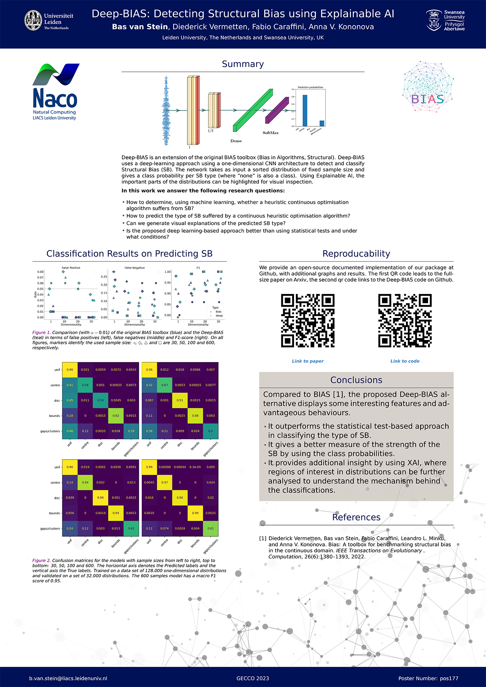

## GECCO 2023, Deep-BIAS

This year at Gecco I have the honor to present two posters.

One of them is about an extension to our [BIAS toolbox](https://github.com/Dvermetten/BIAS){:target="_blank"}, called Deep-BIAS [See full paper](https://arxiv.org/abs/2304.01869){:target="_blank"}. For the other poster see [here](https://nikivanstein.nl/posts/2023/07/gecco-doe2vec/).

[Structural Bias](https://nikivanstein.nl/posts/2023/07/structural-bias/) occurs when a heuristic search algorithm is biased towards certain parts of the search space due to its algorithmic structure (and not due to the objective function it tries to optimize).

It is important to detect structural bias as this is unwanted behaviour in general for heuristic optimization algorithms, as they should be able to find optima independent from where they are in the search space.

[BIAS](https://github.com/Dvermetten/BIAS){:target="_blank"} is a toolbox to find structural bias in heuristic optimization algorithms and provides feedback to the algorithm designer or practisioner about whether there is structural bias present and what type of bias it is.

Deep-BIAS is an extension that introduces a deep-learning model to effectively detect structural bias and predict the type instead of using over 30 statistical tests. The Deep-learning model proved to be on-par with detecting bias and much better in classifying the type of bias, compared to the statistical test approach.

We recommend every optimization algorithm researcher and practisioner to use the BIAS toolbox and verify if the algorithm used or created does not suffer from structural bias. See our [Github](https://github.com/Dvermetten/BIAS){:target="_blank"} for setup instructions and a quick start.

