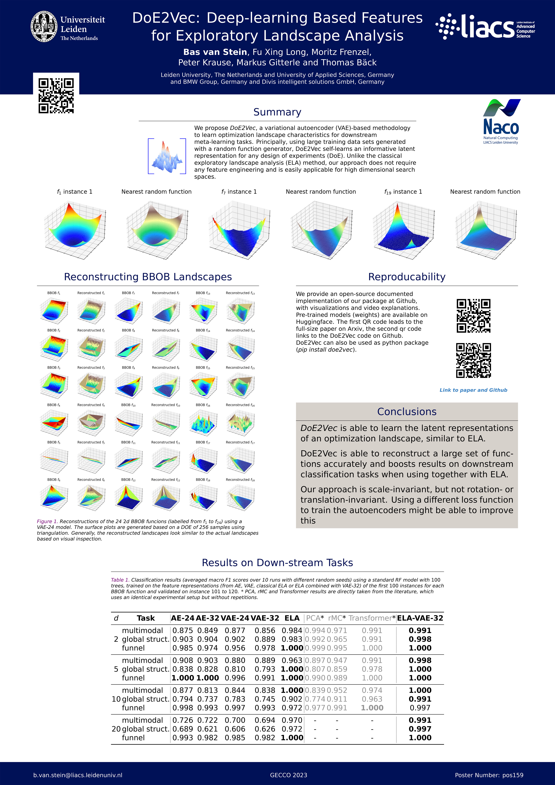

## GECCO 2023, DoE2Vec - Deep-learning Based Features for Exploratory Landscape Analysis

This year at Gecco I have the honor to present two posters.

One of them is about the method [DoE2Vec](https://github.com/Basvanstein/doe2vec){:target="_blank"}, [Read the full paper](https://arxiv.org/abs/2304.01219){:target="_blank"}. For the other poster see [this post](https://nikivanstein.nl/posts/2023/07/gecco-deep-bias/)

DoE2Vec stands for "Design of Experiments to Vector". It is a deep-learning model that aims to learn optimization landscape characteristics in order to use these features for down-stream tasks such as algorithm selection and performance prediction.

The method uses a deep variational auto-encoder and is trained on 250.000 randomly generated function landscapes. It performs well in reconstructing the popular BBOB benchmark functions and the features it learns internally can be succesfully used in a classification task.

There are however limitations to this approach. The model targets to minimize the recontruction loss, but this loss is actually not that relevant in learning important landscape characteristics. We plan to improve the model performance by developing a new loss function or a by using a different architecture.

